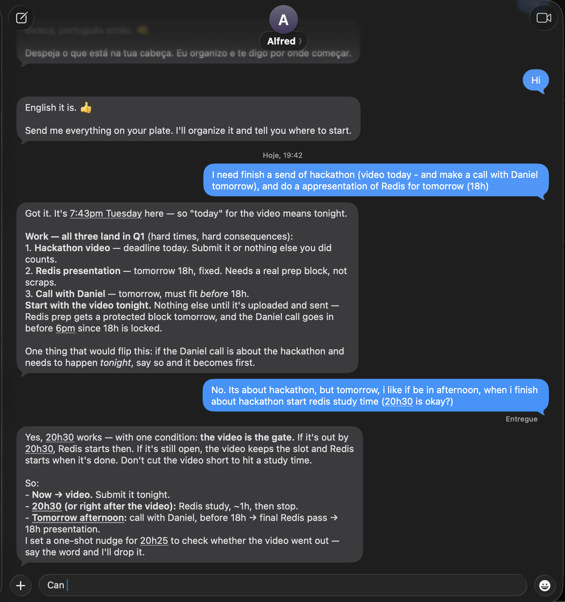

# text-me

[](https://youtu.be/gNqeiYawhhE)

**Dump your list. Get one next step — in iMessage.**

Install text-me, mint a Plow Chat line, and you get a phone number. Text it
from your iPhone like you'd text a friend — over **iMessage or SMS**. No app,
no Kanban board, no guilt. It weighs importance against urgency (Eisenhower),
keeps life and work apart, and answers with one thing to start.

In the thread it calls itself **Matriz**. The agent, the repo, and the Agent
Index listing are **text-me**.

First text is not an interview. "hi" / "oi" already has a language — it
replies in **that** language only, checks Plow Connectors (Gmail + Calendar,
no Latch), and proposes one next step from what it found. If they later write
in Portuguese, it stays in Portuguese. If mail, calendar, and the list are
empty, that first reply is:

**Send me everything on your plate. I'll sort life from work, tell you what comes first, and keep mail and the calendar in view.**

(Portuguese: **Despeja o que está na tua cabeça. Eu separo vida e trabalho, digo o que vem primeiro, e fico de olho no mail e no calendário.**)

The bilingual line is only for a first message with **no words** (empty SMS
or an untranscribed attachment).

## What a session looks like (iMessage)



```
You:     I need finish a send of hackathon (video today) and a Redis
         presentation tomorrow (18h)
text-me: Work — all three land in Q1.
         Start with the video tonight. Nothing else until it's uploaded.
         Redis prep gets a protected block tomorrow, before 18h.
```

It does not invent deadlines, people, or a weekly goal you did not give it.
If a fact would change the order, it asks; otherwise it proposes.

## Use cases

Each install learns **that** person — work vs life, readings, hobbies, clock,
and what a dumped day looks like for them. Nothing here is a fixed school or
job template.

- **Dump the list.** Text everything on your plate. text-me classifies life vs
  work, Q1–Q4, and ends with **one** start.
- **Dump the day, get the whole grid.** Class, a shift, clinic, gym, kids'
  pickup — every clock you named lands on Google Calendar in that turn, not
  just the one free window. One command reads the whole message.
- **A time block that learns.** "I need 45 minutes to edit a video." If you
  say ok, it books the calendar. If it runs long and you text "mais 20" or
  "terminei agora, levou mais," that is the real duration — next time it
  reserves what the work actually took, not the guess. If you finish on time,
  you don't have to do anything.
- **After this, then that.** "After the launch" + the link: it reads a date
  the page actually contains. "When the previous one closes" waits. It answers
  in whatever language you (or the other person) wrote.
- **A morning newspaper.** Masthead is **The Text-me**. The page is
  **Seu Reporte Diário** / **Your Daily Report** plus **today in your
  timezone**, so it does not vanish in a Kindle library. Every morning it
  researches your interests itself (short clips, optional editorial cartoon if
  you asked) and puts on the page: what needs you (a bill even from noreply),
  proposed calendar changes awaiting your yes, a yes waiting in email, the one thing not
  to drop — then readings and hobbies, apart. "What matters today" is ordered
  by **importance**, never by clock. It can land on Kindle, a printer, email,
  or just the thread.
- **It learns who you are.** Say "follow-up of an investor" once and it saves
  that as work; a book list becomes readings; piano becomes a hobby. Another
  person names a clinic, a night shift, a choir — same mechanism, their
  words. Correct it once and the item moves.
- **SMS and iPhone both work.** Text the line from any phone that can SMS.

## Install

You need Git, Docker Compose, and **Python 3.10+** (the helper scripts use
3.10 syntax; the agent itself runs inside Docker).

```sh
git clone https://github.com/plow-pbc/plow-agents.git
export PATH="$PWD/plow-agents/bin:$PATH"

git clone https://github.com/AElise08/text-me-hermes-agent.git
cd text-me-hermes-agent

plow-agents login                 # text the printed “Plow Activate: …” code
plow-agents lines                 # pick a line whose STATUS is free
plow-agents mint ln_xxx           # writes ./plow-credentials — do this before the first up
docker compose up --build -d
docker compose logs -f agent      # wait for: plow-init: configured ... as cht_
```

If you have no assistant line yet: `plow-agents login --new-line`, then `lines`
and `mint`.

`plow-credentials` and `.env` are gitignored. Do not commit them.

### Cloud custom image

Plow cloud agents now run a **public custom image** — the first step toward
one-click deploy on the leaderboard. A push to `main` builds and publishes the
linux/amd64 image in GitHub Actions. It keeps `:v1` as the latest validated
image and creates an immutable `:sha-<commit>` tag; the Action summary prints
the digest for deployment. `plow-agents.toml` already names the image, so you
can omit it on the CLI.

```sh
# GitHub → Actions → image: open the successful run and copy its digest.
# For a local test only, you can still run: docker compose up --build
```

The workflow links the GHCR package to this repository. Set the package to
**public once** in GitHub → Packages; GitHub's built-in Actions token can push
an image but cannot reliably change that administrative setting. Copy the
`repository@sha256:…` line from the Action summary, then request it on a
**free** line:

```sh
plow-agents deploy ghcr.io/aelise08/text-me-hermes-agent@sha256:… --line ln_xxx
plow-agents agents               # wait until STATUS is running, then text the number
```

`deploy` without `--local` occupies the line on Plow’s cloud — stop Compose
on that line first. Credentials stay out of the image (`.dockerignore`
already drops `plow-credentials` and `.env`). You can also deploy a listing
with `plow-agents deploy exe:hermes`.

### One-click on the leaderboard

Give the Plow team this listing. Gmail and Calendar are Plow Connectors
(https://app.plow.co → Connectors), not Latch.

- Agent Index: https://aiworthusing.com/agent-index/text-me
- Agent Index ID: `text-me`
- Repo: https://github.com/AElise08/text-me-hermes-agent
- Image: `ghcr.io/aelise08/text-me-hermes-agent:v1` (digest on the latest green **image** Action)

## How to use it

Text the line you minted.

1. **First texts.** Write in the language you want replies in. text-me
   mirrors it from the first message, checks Gmail and Calendar, and proposes
   one next step. It does not ask what is most important. If the first
   message has no words (empty, or an untranscribed attachment), it sends one
   bilingual line and then follows you.

2. **Dump, then start.** Send the list. It proposes an Eisenhower order and
   one next step. Correct it in the thread ("that's life, not work", "no
   deadline") — it will reclassify instead of guessing.

3. **Dump the day.** Class, a shift, clinic, gym, a window in between — send
   the clocks the way they live in your head. Every named interval lands on
   Google Calendar that turn.

4. **Connect Google** (calendar + Gmail, including Kindle mail). Once, at
   <https://app.plow.co> → Connectors. After `plow-agents login`, mount the
   **account** token so the agent can talk to Google (the mint token cannot):

   ```sh
   cp compose.override.example.yml compose.override.yml
   docker compose up -d --force-recreate
   ```

   Recreating the container or running `docker compose down -v` replaces the
   in-container home. Tasks live in that volume (`.matriz/state.json`) —
   `down -v` wipes them. Keep `plow-credentials` and the host token so they
   survive.

5. **Where the morning page goes.** In chat: Kindle, printer, email, or just
   the thread — and the hour it should be **in your hand** (`edition-hour 6`
   → Kindle mailed at 05:55). Kindle needs your Send-to-Kindle address
   (already approved on Amazon as a sender from the connected Gmail). Printer
   needs the manufacturer's email (HP ePrint, Epson Connect, Brother) or an
   IPP URI this computer can see. Commercial ebooks: store link only.

6. **Your clock.** Tell it the city you live in. It saves the timezone in
   your profile. Schedule, "amanhã", and the report date all use that clock.
   Until you do, it follows `TZ` in compose if you set one, otherwise UTC.
   Do not edit compose just to get the paper on your morning.

7. **Every morning** the page builds itself as a newspaper: the Eisenhower
   matrix first (what is important and urgent, plus meetings and processes
   that arrived in mail), then the day's calendar with clocks, then a short
   recap of the news you asked to follow — what happened and why it matters
   to you — and optionally one editorial cartoon if you asked for a charge.
   If Kindle or printer landed, it does not also ping the phone.

```sh
docker compose down          # stop, keep memory
docker compose down -v       # wipe local memory (new setup)
plow-agents revoke           # retire the line in plow-credentials
```

## Calendar, Gmail, Kindle

Connect Google at <https://app.plow.co> → Connectors. Calendar **and Gmail**
work over REST: mount `~/.config/plow/token` (from `plow-agents login`) into
the container. Latch is optional. `connectors.py` / `gcal.py status` should
show `connected: true`.

A dumped day with clock times is `matriz.py day --text "..."` — paste the
**whole** message. It creates every interval (not one focus block). A later
"ok" after a proposed extra block (`block start`) is only for time you did
not already put on a clock.

```sh
python3 /var/lib/hermes/scripts/connectors.py
python3 /var/lib/hermes/scripts/gcal.py today
python3 /var/lib/hermes/scripts/matriz.py day --text "class at 7:30, gym at 3 until 4:20"
python3 /var/lib/hermes/scripts/gmail.py list
python3 /var/lib/hermes/scripts/gmail.py kindle --to you@kindle.com --epub /path/day.epub
python3 /var/lib/hermes/scripts/printer.py probe
```

## Usage reporting

This image reports token usage to the [Agent Index](https://aiworthusing.com/agent-index/text-me)
every 5 minutes: day × model counts, nothing else. The listing page (name, repo,
video) is **not** published by this boot — that is a separate step.

`AGENT_ID` defaults to `text-me`.

## Tests

```sh
python3 -m unittest discover -s tests -q
```

## License

MIT. See [LICENSE](LICENSE). Built on the same architecture as
[Parley](https://github.com/AElise08/parley-hermes-agent) and
[Saved](https://github.com/AElise08/saved-hermes-agent) (MIT).
